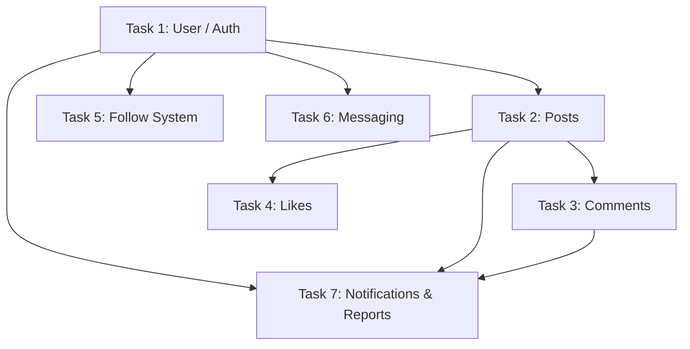

# Task Dependency Map

To help you organize the work among your students, here is the dependency graph and a breakdown of which tasks should be finished first.

## 1. Dependency Graph

## 2. Detailed Breakdown

### Phase 1: The Core Foundation
*   **Task 1: User & Authentication**
    *   **Priority**: CRITICAL (High)
    *   **Reason**: Every other task depends on having a `User` model and a `userId`. Authentication is needed to protect routes.
    *   **Required for**: All other tasks.

### Phase 2: Content & Social Graph
*   **Task 2: Post System**
    *   **Priority**: High
    *   **Reason**: You can't like or comment on something that doesn't exist.
    *   **Depends on**: Task 1.
    *   **Required for**: Task 3 (Comments), Task 4 (Likes), and parts of Task 7 (Reporting Posts).

*   **Task 5: Follow System**
    *   **Priority**: Medium
    *   **Depends on**: Task 1.
    *   **Note**: Can be worked on in parallel with Task 2 if Task 1's User model is defined.

### Phase 3: Engagement & Interaction
*   **Task 3: Comments**
    *   **Depends on**: Task 1 & Task 2.
    *   **Priority**: Medium.

*   **Task 4: Likes / Reactions**
    *   **Depends on**: Task 1 & Task 2.
    *   **Priority**: Medium.

*   **Task 6: Messaging**
    *   **Depends on**: Task 1.
    *   **Priority**: Medium.
    *   **Note**: Relatively independent once Users are implemented.

### Phase 4: Management & Feedback
*   **Task 7: Notifications & Reports**
    *   **Priority**: Low
    *   **Depends on**: Tasks 1, 2, 3, 4, 5, 6.
    *   **Note**: This is the "glue" that connects events (like a user getting a Like or Follow) to a notification record.

## 3. Recommended Student Assignment
1.  **Student A**: Task 1 (Foundation).
2.  **Student B**: Task 2 (Immediately after Student A defines the User model).
3.  **Student C**: Task 5 & Task 6 (Can start after Student A defines the User model).
4.  **Student D**: Task 3 & Task 4 (Can start after Student B defines the Post model).
5.  **Senior Student / Extra Credit**: Task 7 (System-wide integration).
